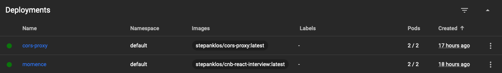

# Currency conversion app via CNB API

React (TypeScript) web application focused on providing information and simple conversions between currencies based on Czech National Bank rates. 

## Tech Stack Frontend
The frontend is using these tools:
- React 18.2 (w/ TypeScript),
- Reactstrap,
- Axios,
- Redux 4.2.

## Running application for preview
- Interview application http://momence.stkl.cz
- Proxy to circumvent CORS on frontend http://cors-proxy.stkl.cz (used in HTTP GET calls)

## Run application locally - use this GitHub repository
```bash
git clone https://github.com/KlosStepan/cnb-react-interview
npm install
npm start
```

## Aplication overview
- We use **Reactstrap**  - grid(Row, Col, Container), Modal, Dropdown, Input etc. becuase it's industry status quo ([maybe I'm a boomer though](https://mui.com)).
- Proxying API call https://www.cnb.cz/en/financial-markets/foreign-exchange-market/central-bank-exchange-rate-fixing/central-bank-exchange-rate-fixing/daily.txt - not accessible on frontend due to CORS restrictions on browser side. We do have to tunnel request via proxy (cors-proxy) and add header `Access-Control-Allow-Origin: *` on our backend while rewrapping and forwarding CNB's reponses.
- In useEffect() do proxied call via. Axios, proceed to parsing, preparations and storing. Fetched data is then stored as `[{Currency}, {Currency}, ...]` for table row components.
- Extensive use of array arrow functions for convenience and elegance `{list.map=>((curr: Currency)=> <Comp curr.sth.../>)}`.
- We store data via **Redux** to access storage in a imperative way and avoid storage problems that might emerge. 
- Custom TypeScript Interface for **Currency**.

## Production notes
Dockerfile
```Dockerfile
FROM node as build
WORKDIR /app
COPY package.json .
RUN npm install --legacy-peer-deps
COPY . .
ARG REACT_APP_NAME
ENV REACT_APP_NAME=$REACT_APP_NAME
RUN npm run build

FROM nginxinc/nginx-unprivileged
COPY --chown=nginx:nginx --from=build /app/build /usr/share/nginx/html
```
Run to `build image` and `push image`
```zsh
docker build -t stepanklos/cnb-react-interview .
docker push stepanklos/cnb-react-interview
```
Kubernetes `Service`+`Deployment` for this React web application (two replicas)
```yaml
apiVersion: v1
kind: Service
metadata:
  name: momence
spec:
  type: ClusterIP
  ports:
  - port: 80
    targetPort: 8080
  selector:
    app: momence
---
apiVersion: apps/v1
kind: Deployment
metadata:
  name: momence
spec:
  replicas: 2
  selector:
    matchLabels:
      app: momence
  template:
    metadata:
      labels:
        app: momence
    spec:
      containers:
      - name: momence
        image: stepanklos/cnb-react-interview:latest
        ports:
        - containerPort: 8080
        env:
        - name: MESSAGE
          value: Hello from momence Deployment!
```
Running Deployments in our Kubernetes Cluster
